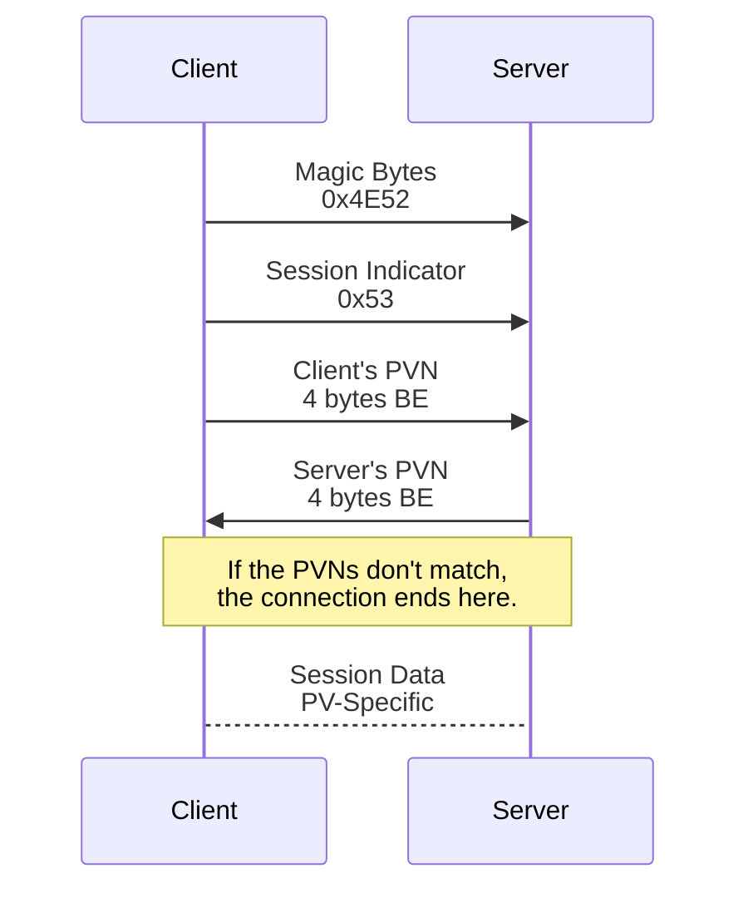

# Networking

There are two different kinds of connections: *queries* and *sessions*.

A session is when a client is connecting with the intent of playing.
The specific networking protocol used for sessions is left up to the PV.

[Queries][queries] always use TCP. Servers may support queries over other 
protocols, but for compatibility, servers must always support TCP.

## Magic Bytes

All connections (session and query) start with the client sending the magic 
bytes, `0x4E52` ('NR' in ASCII).

### Mode Indicators

The next byte sent is a mode indicator, telling the server if this is a 
query or a session.

- `0x51` ('Q' in ASCII): Indicates that this connection is a [query][queries].
- `0x53` ('S' in ASCII): Indicates that this connection is a session.

### Query Mode

See [queries] for more info.

### Session Mode

After sending the magic bytes and session indicator, the client sends its PVN.

The server then responds with its PVN. If the PVNs don't match, the 
connection is terminated. If they do match, the session continues. What 
happens after this is PV-dependent. 
 

[queries]: queries.md
