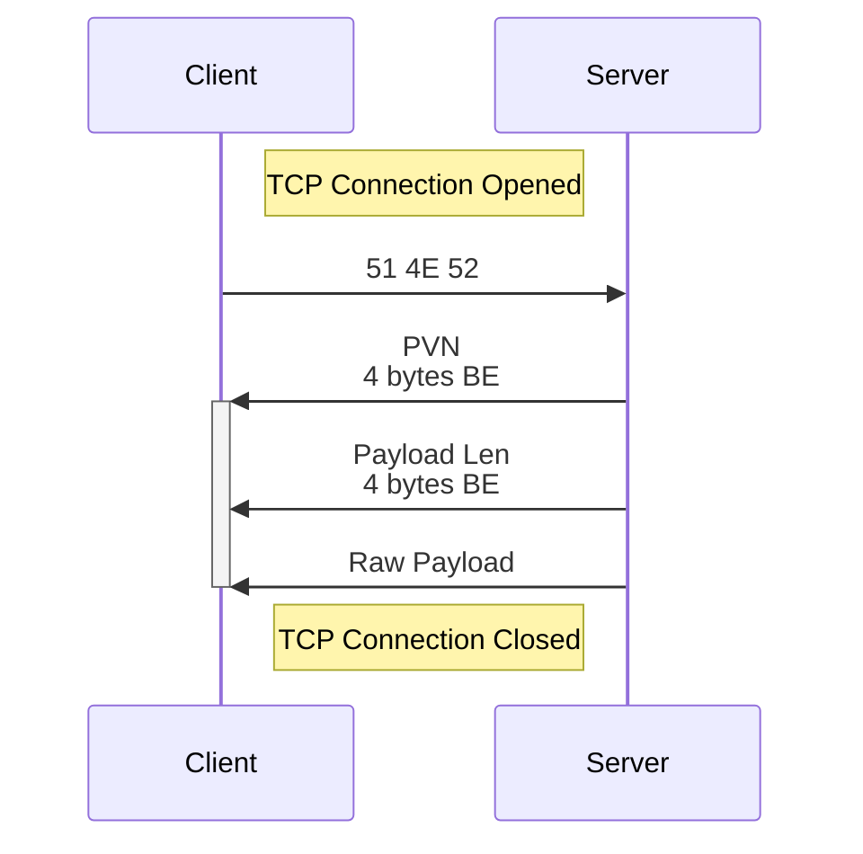

# Queries

A *query* is the process of asking a server for its protocol version and status.

Queries allow any client, launcher, website, etc. to answer a couple 
questions about any inertya server:

### Payloads

The server responds with a payload. The payload content is PV-specific. 
Refer to individual protocol version specifications (under 'query payload') 
for more information.

## Process

All queries happen over TCP. See [networking] for more info.

All queries are initiated by the client, by establishing a TCP connection to 
the server that it wants to query. The client then sends the query indicator,
`51 4E 52` ("QNR" in ASCII).

The server responds first with its 4 byte [PVN][pvn-codec] (big endian),
then the

## Example

[networking]: networking.md
[pvn-codec]: versioning.md#codec
