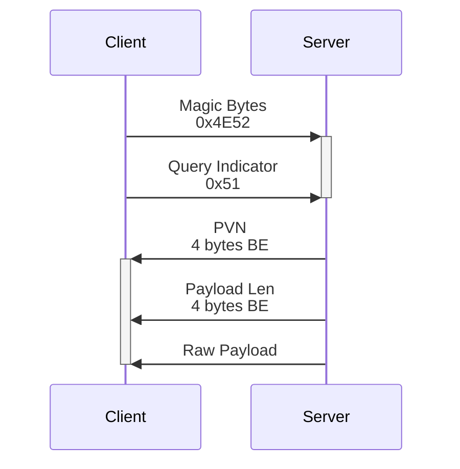

# Queries

A *query* is the process of asking a server for its protocol version and status.

Queries allow any client, launcher, website, etc. to check any inertya 
server's PV and status.

## Payload

The server responds with a payload. The payload content is PV-specific. 
Refer to individual protocol version specifications (under 'query payload') 
for more information on that PV's payload.

### Maximum Payload Length

The maximum length of any payload is 2^24^ (16,777,216) bytes. It is an 
error if a server's query response payload length field exceeds this.

This is meant to prevent [memory exhaustion][wp-exhaustion-attack] attacks.

## Process

All queries happen over TCP. See [networking] for more info.

All queries are initiated by the client, by establishing a TCP connection to 
the server that it wants to query. The client sends the [magic bytes] 
(`0x4E52`), then the [query indicator] (`0x51`).

The server responds with three things:
- The current PVN (see [Versioning#codec][pvn-codec])
- The length of the payload, as a 4 byte

[wp-exhaustion-attack]: https://en.wikipedia.org/wiki/Resource_exhaustion_attack
[networking]: networking.md
[magic bytes]: networking.md#magic-bytes
[query indicator]: networking.md#mode-indicators
[pvn-codec]: versioning.md#codec
